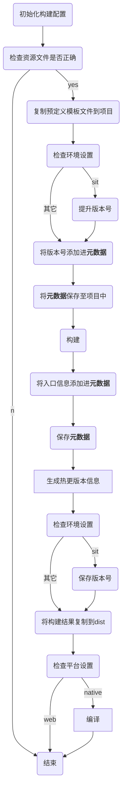

## 如何开始  

1. #### 在你自己的工程中运行以下命令： 
    ```
    git submodule add git@git.jinpin.com:client/tools/ccc-builder.git ccc-builder
    ```
    
2. #### 在自已的工程目录上的gulpfile.js文件中加入（如果没有，则新建,或使用gulp初始化命令进行初始化)：
    ```bash
    requireDir("./ccc-builder/gulpTasks")
    ```
    
3. #### 执行下面命令进行初始化:
    ```bash
    gulp build-init
    ```
    如果项目下已经有了同名文件，此命令不会进行覆盖，如果需要强制覆盖，请使用```--force true```选项

    ```bash
    gulp build-init --force true
    ```
    
4. #### 根据项目需要，对build.json文件内容进行修改:
    ```typescript
    {
        // 项目当前版本 
        "version": "0.0.14",
        // 项目标识
        "itemId": 2431,
        // 版本热更路径规则，一般保持默认即可
        "remoteRule": [
            "remoteUrl",
            "itemId",
            "/"
        ],
        // 版本热更文件存放目录
        "manifestDest": "assets/resources",
        // 构建目录
        "buildPath": "build/",
        // 是否开启debug
        "debug": true,
        // 是否生成sourceMaps文件
        "sourceMaps": true
    }
    ```
    
5. #### 修改env/build.json中的内容，对各个环境的配置进行定制
6. #### 在项目根目录下使用以下命令进行构建
    ```typescript
    gulp build
    ```
    
7. #### 如果将 .gitlab-ci.yml 放在工程根目录下，则可支持gitlab的自动布署:  

   + 自动布署要求的git分支结构:
   
      - develop: 用于日常开发，此分支的修改不会触发任何动作
      - sit: 对应 sit(集成测试环境), 当此分支发生更改时，会自动执行编译,构建动作，并将结果推送至sit 环境
      - hk-sit: 对应 ~~hk-sit(香港服务器的集成测试环境)~~ hk-uat(香港服务器用户测试环境), 当此分支发生更改时，会自动执行编译,构建动作，并将结果推送至~~hk-sit~~ hk-uat 环境
      - uat: 对应 uat(用户测试环境), 当此分支发生更改时，会自动执行编译,构建动作，并将结果推送至uat 环境
      - ppro: 对应 ppro(预生产环境), 当此分支发生更改时，会自动执行编译,构建动作，并将结果推送至ppro 环境
      - pro: 对应 pro(生产环境), 当此分支发生更改时，会自动执行编译,构建动作，并将结果推送至pro 环境

#### 其它命令:
1. 切换当前环境
    ```bash
    gulp switchEnv --env 环境名称
    eg:
        gulp switchEnv --env uat
    ```

2. 检查项目Assets是否正确:
    ```bash
    gulp checkAssets
    ```

3. 更新命令
    ```bash
    gulp build-update
    ```

    例子,下面的命令先首先更新构建工具至最新版本，而后再强制应用更新后的文件/环境设置:
    ```bash
    gulp build-update
    gulp build-init --force ture
    ```

#### 打包流程  





