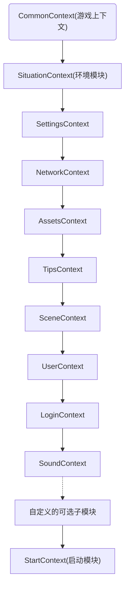
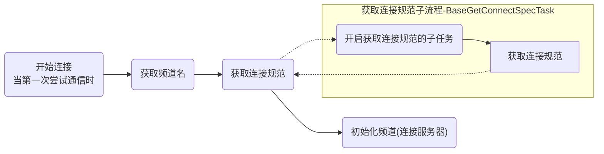
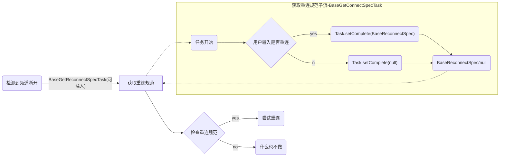

# ccc-libs 

## 目录

+ [**如何开始**](#howToStart)
+ [**概述**](#brief)
+ [**总体构成**](#constructure)
+ [**重要任务**](#tasks)
+ [**重要流程**](#flow)
  + [启动流程](#flow-start)
  + [连接流程](#flow-conn)
  + [断线重连流程](#flow-re-conn)
  + [热更新流程](#flow-hotupdate)

<a name = howToStart id = howToStart></a>
## 如何开始 

1. ### 在你自己的工程中运行以下命令，以引入库的发布版:  
    ```
    git submodule add git@git.jinpin.com:client/ccc-jp-libs-pub.git ccc-jp-libs
    ```

2. ### 在自已的工程目录上的gulpfile.js文件中加入（如果没有，则新建,或使用gulp初始化命令进行初始化)：
    ```
    var requireDir = require("require-dir");
    requireDir("./ccc-jp-libs/gulpTasks")
    ```

3. ### 使用命令更新库文件  
    ```
    gulp libs-update
    ```

经过上述步骤后，如果一切正常，此时，ccc-libs已经处于可用状态。但要想让你的项目真正的被ccc-libs接管，还需要再做一些适配:<br>
1. 项目主逻辑入口:<br>
   项目的主逻辑入口通过装饰器来标识：
   ```typeScript
   @MainLogicService.makeEntrance(你的项目唯一标识)
   export default class GameContext extends CommonContext {
    // class body
   }
   ```
   
2. 项目启动场景:<br>
   项目启动场景通过以下装饰器标识: 
    ```typescript
    export default class YourSceneNamesConfig extends SceneNames {
      @SceneUtils.firstScene
      public static readonly LOBBY_LOGIN_SCENE:string = "yourSceneName";
    }
    ```

3. 大厅场景 
    当游戏通过大厅app运行时，大厅APP将需要知道*大厅场景*,其同样使用装饰器标识: 
    ```typescript
    export default class YourSceneNamesConfig extends SceneNames {
      @SceneUtils.inLobbyScene("你的项目唯一标识")
      public static readonly LOBBY_LOGIN_SCENE:string = "yourSceneName";
    }
    ```
    请注意：以上两个场景可以是同一个场景

<a name="brief" id="brief"></a>
## 概述 
<a name="constructure" id="constructure"></a>
## 总体构成 

目前ccc-libs主要由以下模块组成:  
### 基础模块   
1. **SituationContext** (*环境模块*)  
    环境模块封装了从运行环境中获取相关数据/信息的逻辑，比如，`登录帐户/Token，服务器连接地址`等。
    <br>此处的`运行环境`被定义为`除了应用本身之外的任何途径`,因此其甚至包括了`用户输入`。
2. **SettingsContext** (*设置模块*)  
3. **NetworkContext** (*网络模块*)  
4. **AssetsContext** (*资源模块*)  
5. **TipsContext** (*提示模块*)  
6. **SceneContext** (*场景模块*)  
7. **UserContext** (*用户模块*)  
8. **LoginContext** (*登录模块*)  
9. **SoundContext** (*声音模块*)  

### 可选模块
  公共库暂时未预置任何可选模块，但可由各自的子项目自行根据需求添加。
### 后置模块
1. **StartContext** (*启动模块*)  

<a id="tasks" name="tasks"></a>
## 重要任务:

<a id="flow" name="flow"></a>
## 重要流程:
<a id="flow-start" name="flow-start"></a>

1. **启动流程** (各个模块的流程请查看对应流程)  



<a id = "flow-conn" name="flow-conn"> </a>

2. **连接流程** 



<a id="flow-re-conn" name="flow-re-conn" /></a>

2. **断线重连**  



<a id="flow-hotupdate" name="flow-hotupdate"></a>  

3. 热更新  

  ```mermaid
graph TB
launch("启动")


makeSureInstallMeta("确保安装元数据正确")
getLocalManifest("获取本地资源描述文件")
downloadRemoteManifest("下载远程资源描述文件(<b>通过版本号</b>)")
compareManifest("对比本地与远程资源(<b>最新版本</b>)</br>是否需要更新")
update("更新")
over("流程结束")
restart("重启")

launch --> makeSureInstallMeta
makeSureInstallMeta --> getLocalManifest

getLocalManifest --有--> compareManifest
compareManifest --是--> update
compareManifest --否--> over

getLocalManifest --无--> downloadRemoteManifest
downloadRemoteManifest --> compareManifest
update --> restart
restart --> launch

    subgraph 确保安装元数据正确-MakeSureInstallMetaTask
        getInstallMeta("获取安装元数据")
        initInstallMeta("初始化安装元数据")
        checkInstallMeta("检查安装元数据<br/><i>是否与安装包中的一致?</i>")
        clear("清理历史热更数据<br/>与安装元数据")
        metaComplete("确保安装元数据任务完成")
        getInstallMeta --成功--> checkInstallMeta
        getInstallMeta --失败--> initInstallMeta
        checkInstallMeta--是-->metaComplete
        checkInstallMeta--否-->clear
        clear --> initInstallMeta
        initInstallMeta --> metaComplete
    end

``` 


## TODO  
- [ ] NetworkServer优化
